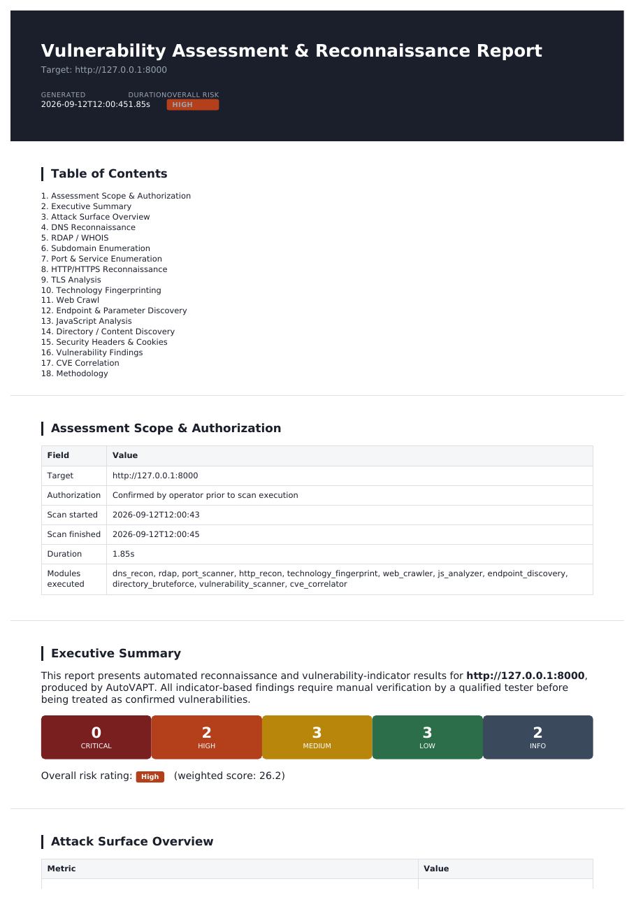
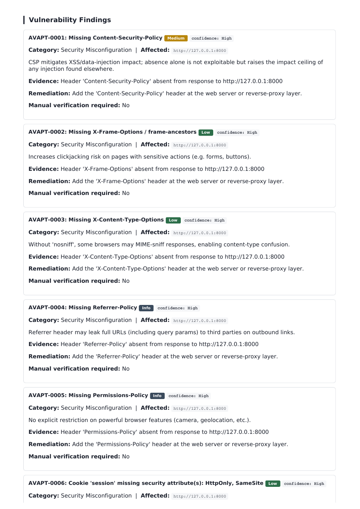

# AutoVAPT — Dependency-Free VAPT & Reconnaissance Framework


AutoVAPT chains a full reconnaissance-and-assessment pipeline —
**DNS → subdomains → RDAP/WHOIS → ports → HTTP/TLS → tech
fingerprinting → crawling → endpoints → JavaScript analysis → content
discovery → vulnerability indicators → CVE correlation → attack
surface map → risk scoring** — into one command, and produces a
**client-style HTML/PDF report** plus structured JSON output.

**The core framework requires zero third-party Python packages.**
Clone it and run it — no `pip install -r requirements.txt` needed.
Nmap, FFUF, Nikto, `dig`, and `whois` are optional integrations that
unlock deeper results when installed; their absence never breaks a
scan.

> ⚠️ **For authorized security testing and educational use only.**
> See [DISCLAIMER.md](DISCLAIMER.md). Never scan a system you don't
> own or don't have explicit written permission to test.

---

## Why this exists

Most beginner recon/VAPT projects are a thin wrapper around Nmap with
a screenshot. AutoVAPT is built to demonstrate the *methodology* of an
assessment end-to-end: authorization → scoping → recon → enumeration →
evidence-based vulnerability triage → risk-rated, client-ready
reporting — the same shape as a real engagement, deliberately
constrained to stay non-destructive and portfolio-appropriate.

It is **not** a replacement for Burp Suite, Nmap, Nuclei, OWASP ZAP, or
a commercial scanner. It's an orchestration and learning framework that
combines native Python capabilities with those tools when available.

---

## Sample Report

| Cover & Risk Summary | Findings (schema: severity/confidence/evidence/remediation) |
|---|---|
|  |  |

Full sample outputs (generated against the bundled local lab target,
no live scan needed to see them) are included:
- [`docs/sample_vapt_report.pdf`](docs/sample_vapt_report.pdf)
- [`docs/sample_vapt_report.html`](docs/sample_vapt_report.html)
- [`docs/sample_raw_results.json`](docs/sample_raw_results.json)

---

## Installation — no pip required

```bash
git clone https://github.com/AdwaidhR/AutoVAPT.git
cd AutoVAPT
python3 main.py --check-dependencies
```

That's it. The core framework is ready to run immediately.

```
=======================================================
 AutoVAPT Dependency Check
=======================================================
 [+] python3      Available
 [-] nmap         Not Installed
 [-] ffuf         Not Installed
 [-] nikto        Not Installed
 [-] dig          Not Installed
 [-] whois        Not Installed
-------------------------------------------------------
 [+] Core framework: Ready (stdlib-only, works regardless of tools above)
=======================================================
```

### Optional external tools

| Tool | Unlocks | Install (Debian/Ubuntu) |
|---|---|---|
| `nmap` | Accurate service/version detection (`-sV`) instead of raw connect-scan | `sudo apt install nmap` |
| `ffuf` | Faster, more feature-rich content discovery | see [ffuf releases](https://github.com/ffuf/ffuf) |
| `nikto` | Additional web server misconfiguration checks | `sudo apt install nikto` |
| `dig` / `host` / `nslookup` | Full DNS record types (MX/NS/TXT/SOA/CNAME) | `sudo apt install dnsutils` |
| `whois` | Registrar-level WHOIS text (RDAP is tried first regardless) | `sudo apt install whois` |
| `wkhtmltopdf` or `libreoffice` | PDF report export (HTML report always works without these) | `sudo apt install wkhtmltopdf` |

None of these are required. Every one of them has a native Python
fallback; the framework only tells you what you're missing.

---

## Usage

```bash
# Full scan, HTML report
python3 main.py --target https://example.com --authorized

# Deeper scan: full 65535 port range, more crawl pages/threads
python3 main.py --target https://example.com --authorized --deep

# Skip port scanning, use a custom port range
python3 main.py --target https://example.com --authorized --skip-ports
python3 main.py --target https://example.com --authorized --ports 1-65535
python3 main.py --target https://example.com --authorized --top-ports

# Use FFUF / Nikto if installed
python3 main.py --target https://example.com --authorized --ffuf
python3 main.py --target https://example.com --authorized --nikto

# Both HTML + PDF report
python3 main.py --target https://example.com --authorized --format both

# Check what optional tools are available
python3 main.py --check-dependencies

# Or via the shell wrapper
./run.sh --target https://example.com --authorized
```

Every scan requires an explicit `--authorized` (alias `--yes`) flag,
and by default still asks for an interactive `y/N` + `I CONFIRM`
before any active module runs. Use `--non-interactive` alongside
`--authorized` for CI/lab automation.

### Full flag reference

```
--target / -t          Target domain, IP, or URL
--authorized / --yes    Confirm you are authorized to test this target
--non-interactive       Skip interactive prompts (still requires --authorized)
--deep                  Full port range + more crawl pages/threads
--ports                 '1-1000' | '22,80,443' | 'top-100' (default: 1-1000)
--top-ports             Shortcut for --ports top-100
--max-pages             Max pages to crawl (default: 50)
--crawl-depth           Max crawl depth (default: 2)
--threads               Thread count (default: 30)
--wordlist              Custom wordlist for content discovery
--extensions            Comma-separated extensions, e.g. php,html,bak
--ffuf / --nikto        Use these tools if installed
--skip-ports/-crawl/-content/-subdomains
--output / -o           Output directory (default: reports/)
--format                html | pdf | both
--verbose               Debug-level logging
--check-dependencies    Report optional tool availability and exit
```

### Try it safely — bundled local lab target

```bash
# Terminal 1
python3 examples/lab_server.py 8000

# Terminal 2
python3 main.py --target http://127.0.0.1:8000 --authorized
```

The lab server intentionally omits security headers, exposes a fake
`.git/HEAD` and `backup.sql`, sets an insecure cookie, and reflects
input — enough to exercise every finding category without touching any
real system.

---

## Architecture

```
Authorization → Target Validation → DNS Recon → Subdomain Discovery
    → RDAP/WHOIS → Port Scan → HTTP/HTTPS Recon → TLS Analysis
    → Tech Fingerprinting → Web Crawl → Endpoint Discovery
    → JS Analysis → Content Discovery → Vulnerability Indicators
    → CVE Correlation → Attack Surface Map → Risk Scoring → Report
```

See [`docs/architecture.md`](docs/architecture.md) for the full module
dependency graph and the stdlib-replacement table (what each avoided
third-party library was replaced with, and how). See
[`docs/methodology.md`](docs/methodology.md) for the design principles
behind each phase.

## Project Structure

```
AutoVAPT/
├── main.py                        # CLI orchestrator
├── run.sh                         # Shell wrapper
├── config.json                    # Default settings (JSON, not YAML)
├── requirements-optional.txt      # Only needed for optional PDF via weasyprint
├── modules/
│   ├── authorization.py           # Ethical/legal gate
│   ├── external_tools.py          # nmap/ffuf/nikto/dig/whois detection
│   ├── dns_recon.py               # DNS records, reverse DNS
│   ├── subdomain_enum.py          # crt.sh + wordlist resolution
│   ├── rdap.py                    # RDAP (urllib) + whois fallback
│   ├── port_scanner.py            # Native TCP scan + optional nmap
│   ├── http_recon.py              # Shared urllib-based HTTP client
│   ├── tls_analyzer.py            # ssl module cert/protocol inspection
│   ├── technology_fingerprint.py  # Evidence + confidence tech detection
│   ├── web_crawler.py             # Bounded same-host crawler
│   ├── endpoint_discovery.py      # Aggregated endpoint inventory
│   ├── js_analyzer.py             # Static JS analysis (no execution)
│   ├── directory_bruteforce.py    # Content discovery + soft-404 filter
│   ├── vulnerability_scanner.py   # Non-destructive indicator checks
│   ├── cve_correlator.py          # Conservative NVD correlation
│   ├── attack_surface.py          # Structured summary tree
│   ├── risk_engine.py             # Evidence-weighted risk scoring
│   ├── report_generator.py        # stdlib HTML report + optional PDF
│   └── utils.py                   # Logging, subprocess helpers
├── wordlists/{common_dirs.txt, subdomains.txt}
├── examples/lab_server.py         # Safe local test target
├── tests/                         # unittest suite (no pytest needed)
├── docs/{methodology,architecture,interview-guide}.md + samples
├── DISCLAIMER.md
└── LICENSE
```

## Testing

```bash
python3 -m unittest discover -s tests -v
```

No `pytest` required — the whole suite runs on `unittest` from the
standard library, covering URL normalization, authorization logic,
port-spec parsing, header/cookie analysis, soft-404 detection, and risk
scoring.

## Safety & Limitations

- Every active module is non-destructive: reconnaissance, enumeration,
  and indicator detection only — no exploitation, credential theft, or
  persistence. See [DISCLAIMER.md](DISCLAIMER.md).
- Every vulnerability finding and CVE match carries an explicit
  `confidence` level and, where appropriate,
  `manual_verification_required: true` — nothing is reported as
  "confirmed" from an automated indicator alone.
- The native port scanner is a TCP-connect scan — slower and less
  precise than Nmap's SYN scan/service fingerprinting, which is why
  Nmap is used automatically when available.
- CVE correlation is keyword-based against the NVD API, not exact CPE
  version-range matching — every hit is labeled "Potential CVE Match"
  requiring manual confirmation.
- The crawler does not execute JavaScript, so heavily client-rendered
  (SPA) applications will under-report endpoints without
  FFUF/manual follow-up.

## Roadmap

- Authenticated scanning (session/cookie reuse across crawl + content discovery)
- Proper CPE version-range comparison for CVE correlation
- Companion Active Directory attack-path project (GOAD lab, Kerberoasting/BloodHound)
- Lightweight web dashboard in place of static reports

## License

MIT — see [LICENSE](LICENSE).
