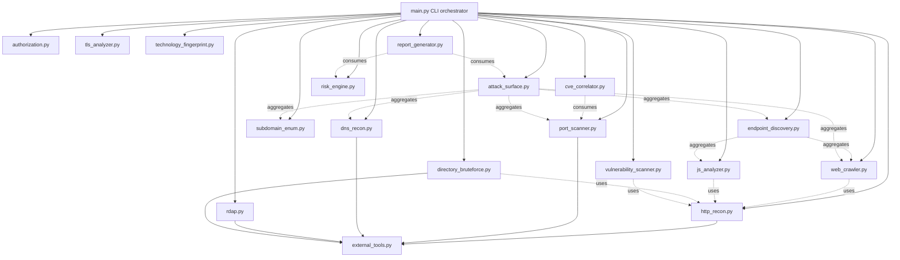

# Architecture

## Module dependency graph



## Layering

```
+-------------------------------------------------------------+
|                        main.py (CLI)                        |
|  argparse -> pipeline orchestration -> results dict -> report|
+-------------------------------------------------------------+
          |                    |                    |
+-------------------+ +------------------+ +-------------------+
|  Recon Layer      | |  Web Layer       | |  Analysis Layer   |
|  dns_recon        | |  http_recon      | |  vulnerability_   |
|  subdomain_enum   | |  tls_analyzer    | |    scanner        |
|  rdap             | |  web_crawler     | |  cve_correlator   |
|  port_scanner     | |  technology_     | |  risk_engine      |
|                    | |    fingerprint   | |  attack_surface   |
|                    | |  js_analyzer     | |                   |
|                    | |  endpoint_       | |                   |
|                    | |    discovery     | |                   |
|                    | |  directory_      | |                   |
|                    | |    bruteforce    | |                   |
+-------------------+ +------------------+ +-------------------+
          |                    |                    |
+-------------------------------------------------------------+
|              Shared Foundation (stdlib-only)                 |
|  utils.py (logging, subprocess helpers, JSON I/O)             |
|  external_tools.py (nmap/ffuf/nikto/dig/whois detection)      |
|  authorization.py (the ethical/legal gate)                   |
+-------------------------------------------------------------+
```

## Why no third-party dependencies in the core

Every network operation in AutoVAPT maps to a stdlib primitive:

| Capability | Third-party lib (avoided) | Stdlib replacement used |
|---|---|---|
| HTTP requests | `requests` | `urllib.request`, `http.client` |
| HTML templating | `Jinja2` | Plain Python string building + `html.escape` |
| YAML config | `PyYAML` | `config.json` (`json` module) |
| DNS record types | `dnspython` | `socket.getaddrinfo` + `dig`/`host`/`nslookup` subprocess fallback |
| WHOIS | `python-whois` | `whois` system binary via `subprocess`, graceful skip if absent |
| PDF export | `weasyprint` (mandatory) | `weasyprint` (optional) -> `wkhtmltopdf` -> `libreoffice --headless` -> skip |
| HTML parsing (crawler) | `BeautifulSoup` | `html.parser.HTMLParser` |

This means `git clone` + `python3 main.py` works with **zero** `pip
install` steps. Optional tools only add depth (e.g. Nmap's `-sV`
service/version fingerprinting is materially better than a raw
TCP-connect scan) - they never gate basic functionality.

## Data flow

Every module returns a plain JSON-serializable dict. `main.py` collects
these into one `results` dict with a fixed top-level schema (`target`,
`dns`, `subdomains`, `rdap`, `ports`, `web`, `tls`, `technologies`,
`crawl`, `endpoints`, `javascript`, `content_discovery`, `findings`,
`cves`, `attack_surface`, `risk`, `metadata`). `report_generator.py`
consumes that single dict to produce both `raw_results.json` (for
tooling/CI) and `vapt-report.html`/`.pdf` (for humans) - there is no
hidden state or side-channel between modules.
